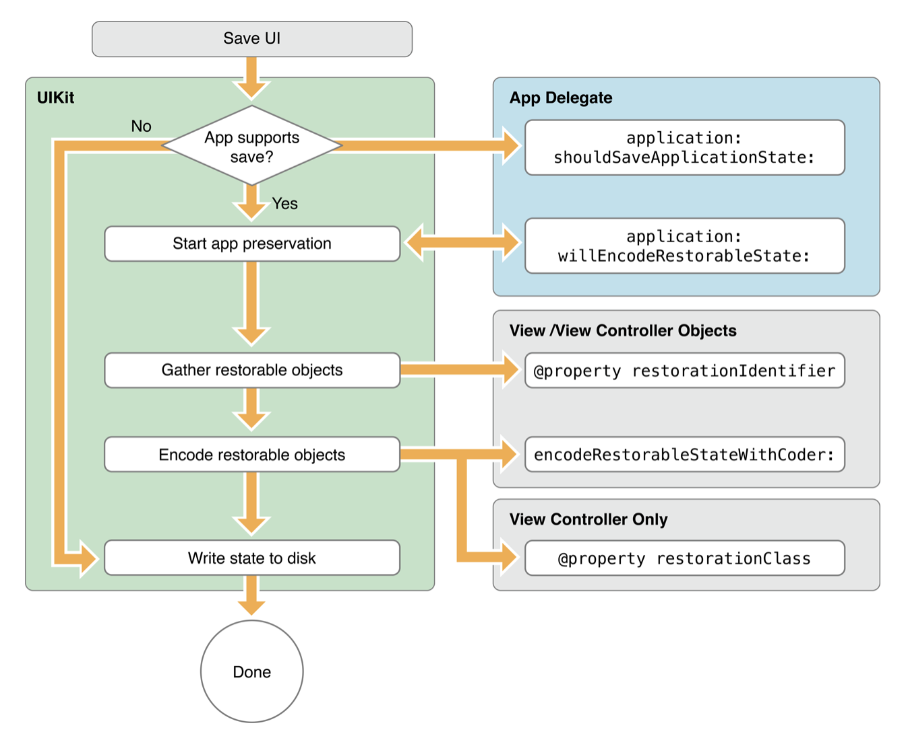
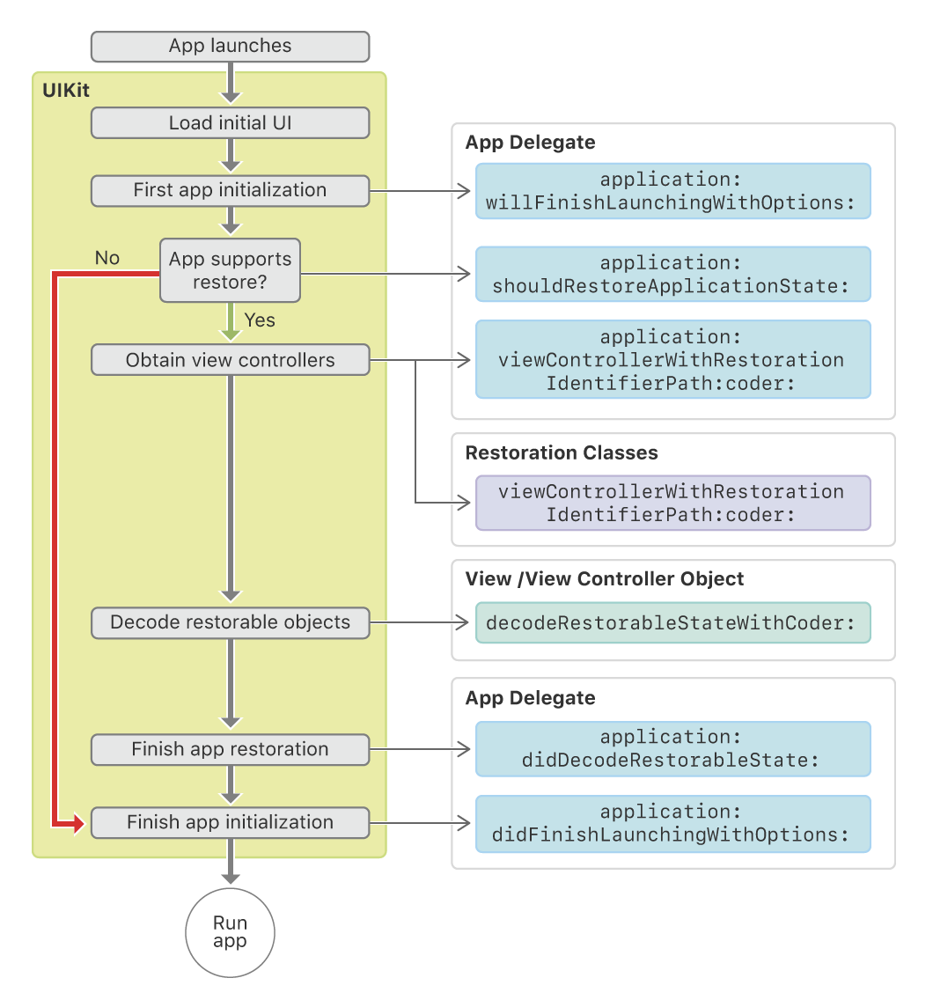

# Orion iOS test task

Use UIKit and WebKit in Swift to implement web page navigation, page zoom, and app state restoration features.

Minimum deployment target: iOS 13.0

## Tasks

- [x] WKWebView and bottom toolbar back/forward(/refresh) navigation buttons
- [x] Start view with centered start button which load a URL in WKWebView full screen
  - Top progress bar appear on loading a URL, fade out with animation on finishing loading
- [x] Page zoom gestures
- [x] Back/forward buttons navigation:
  - Through WKWebView.backForwardList and between start view and WKWebView
  - Corresponding enabled states of back/forward(/refresh) buttons
- [x] Screen edge pan gestures navigation:
  - Through WKWebView.backForwardList and between start view and WKWebView
  - Corresponding enabled states of back/forward(/refresh) buttons
- [ ] Save/restore WKWebView navigation history between app launches
  - Implemented all methods listed in the two articles [About the UI preservation process](https://developer.apple.com/documentation/uikit/view_controllers/preserving_your_app_s_ui_across_launches/about_the_ui_preservation_process) and [About the UI restoration process](https://developer.apple.com/documentation/uikit/view_controllers/preserving_your_app_s_ui_across_launches/about_the_ui_restoration_process) (demonstrated in the two diagrams below).
  - Specified `restorationIdentifier` values of `ViewController`, the root `UINavigationController`, `ViewController.view`, `ViewController.progressBar`, and `ViewController.webView`.
  - Specified `restorationClass` values of `ViewController`.
  - Defined a Swift structure `BrowserState` that stores two properties `webViewInteractionState` and `fullWebViewVisibleState` for preserving and restoring `ViewController.webView.interactionState` (browsing history) and `ViewController.fullWebViewVisibleState` (webView visible state and back/forward button enabled states).
  - Store and load `BrowserState` records in the local file system with the help of `FileManager`.
  - State (browsing history) restoration does not work right now.

| UI Preservation                                                                          | UI Restoration                                                                         |
| ---------------------------------------------------------------------------------------- | -------------------------------------------------------------------------------------- |
|  |  |

## Package Dependencies

- [SwiftLog](https://github.com/apple/swift-log): logging
- [SwiftLint](https://github.com/realm/SwiftLint): format and style enforcement

## Demo Video Clips

Load WKWebView:

| First load                                                                                                          | Refresh                                                                                                             |
| ------------------------------------------------------------------------------------------------------------------- | ------------------------------------------------------------------------------------------------------------------- |
| <video src="https://user-images.githubusercontent.com/39738304/197377360-1badde87-4e5a-4781-8784-68308f582390.mov"> | <video src="https://user-images.githubusercontent.com/39738304/197377588-f57d5c89-578c-452f-b4c0-b29173612ef0.mov"> |

WKWebView back/forward navigations:

| Buttons                                                                                                             | Gestures                                                                                                            |
| ------------------------------------------------------------------------------------------------------------------- | ------------------------------------------------------------------------------------------------------------------- |
| <video src="https://user-images.githubusercontent.com/39738304/197377472-3930276d-244f-4094-8d1f-482e1a3acea5.mov"> | <video src="https://user-images.githubusercontent.com/39738304/197377483-c1084855-3d47-4299-b26f-49f9ea18bb9b.mov"> |

Back/forward navigations between WKWebView and start view

| Buttons                                                                                                             | Gestures                                                                                                            |
| ------------------------------------------------------------------------------------------------------------------- | ------------------------------------------------------------------------------------------------------------------- |
| <video src="https://user-images.githubusercontent.com/39738304/197377643-48a19acd-208b-44a5-afab-8d93ba215609.mov"> | <video src="https://user-images.githubusercontent.com/39738304/197377644-1bc7f9b6-3996-4771-8f03-685519f72595.mov"> |
